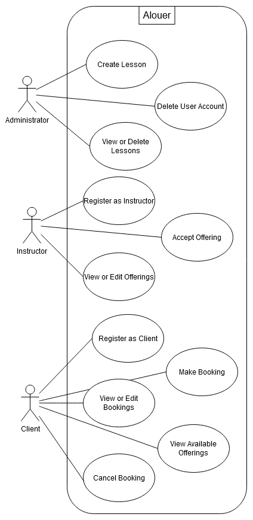
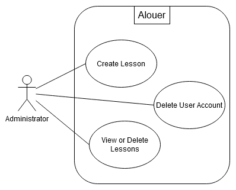
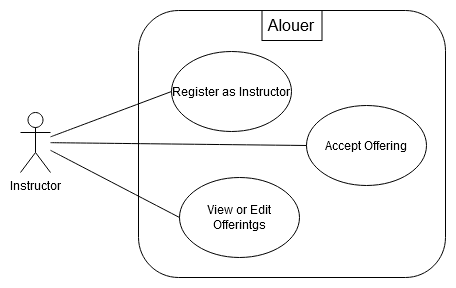
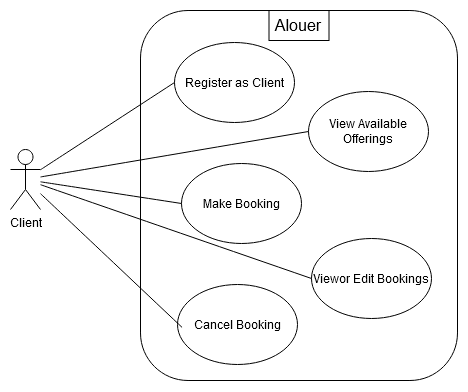

| Revision Number | Date       | Description of Changes     | Author / Editor            | Communication of Change |
| --------------- | ---------- | -------------------------- | -------------------------- | ----------------------- |
| 1.0             | 2024-10-16 | Initial version            | Nirav Patel                | Internal Announcement   |
| 1.1             | 2024-10-22 | Refactor use case diagrams | Nirav Patel                | Internal Announcement   |
| 1.2             | 2024-11-03 | Refactor use case diagrams | Nirav Patel, Laurenz Gomez | Internal Announcement   |

# Table of Contents

- [Summarized Diagram](#summarized-diagram)
- [Administrator Use Cases](#administrator-use-cases)
  - [Create Lesson](#create-lesson)
  - [Delete User Account](#delete-user-account)
  - [Use Case Diagram for Administrator](#use-case-diagram-for-administrator)
- [Instructor Use Cases](#instructor-use-cases)
  - [Register as Instructor](#register-as-instructor)
  - [Accept Offering](#accept-offering)
  - [Use Case Diagram for Instructor](#use-case-diagram-for-instructor)
- [Client Use Cases](#client-use-cases)
  - [Register as Client](#register-as-client)
  - [View Available Offerings](#view-available-offerings)
  - [Make Booking](#make-booking)
  - [View or Edit Bookings](#view-or-edit-bookings)
  - [Register Underage Dependent](#register-underage-dependent)
  - [Use Case Diagram for Client](#use-case-diagram-for-client)

# Summarized Diagram

# Administrator Use Cases

## Create Lesson

| Name                | Create Lesson                          |
| ------------------- | -------------------------------------- |
| Participating Actor | Administrator                          |
| Entry Condition     | Administrator is logged in.            |
| Exit Condition      | A new lesson is added into the system. |

## Delete User Account

| Name                | Delete User Account                                   |
| ------------------- | ----------------------------------------------------- |
| Participating Actor | Administrator                                         |
| Entry Condition     | Administrator is logged in.                           |
| Exit Condition      | The selected user account is deleted from the system. |

## Use Case Diagram for Administrator

# Instructor Use Cases

## Register as Instructor

| Name                | Register as Instructor                          |
| ------------------- | ----------------------------------------------- |
| Participating Actor | Unregistered instructor                         |
| Entry Condition     | The instructor is not registered                |
| Exit Condition      | The instructor account is created in the system |

## Accept Offering

| Name                | Accept Offering                                         |
| ------------------- | ------------------------------------------------------- |
| Participating Actor | Instructor                                              |
| Entry Condition     | Instructor is logged in and the offering is unassigned. |
| Exit Condition      | The offering is assigned to the instructor.             |

## View or Edit Offerings

| Name                | View or Edit Offerings                                                             |
| ------------------- | ---------------------------------------------------------------------------------- |
| Participating Actor | Instructor                                                                         |
| Entry Condition     | Instructor is logged in and has at least one offering.                             |
| Exit Condition      | Any of the selected offering belonging to the instructor may be deleted if chosen. |

## Use Case Diagram for Instructor

# Client Use Cases

## Register as Client

| Name                | Register as Client                       |
| ------------------- | ---------------------------------------- |
| Participating Actor | Unregistered client                      |
| Entry Condition     | Client is not registered.                |
| Exit Condition      | Client account is created in the system. |

## View Available Offerings

| Name                | View Available Offerings                                                                  |
| ------------------- | ----------------------------------------------------------------------------------------- |
| Participating Actor | Client                                                                                    |
| Entry Condition     | None (public access)                                                                      |
| Exit Condition      | Available offerings (assigned to an instructor and not taken (if private)) are displayed. |

## Make Booking

| Name                | Make Booking                                                           |
| ------------------- | ---------------------------------------------------------------------- |
| Participating Actor | Client                                                                 |
| Entry Condition     | Client is logged in and an offering is available.                      |
| Exit Condition      | Booking is created and offering, if private, is marked as unavailable. |

## View or Edit Bookings

| Name                | View or Edit Bookings                             |
| ------------------- | ------------------------------------------------- |
| Participating Actor | Client                                            |
| Entry Condition     | Client is logged in and has at least one booking. |
| Exit Condition      | If chosen, any selected booking can be deleted.   |

## Register Underage Dependent

| Name                | Register Underage Dependent                                           |
| ------------------- | --------------------------------------------------------------------- |
| Participating Actor | Client (Adult Guardian)                                               |
| Entry Condition     | Client is logged in and the underage dependent is under 18 years old. |
| Exit Condition      | Underage dependent is registered under the client's account.          |

## Use Case Diagram for Client

