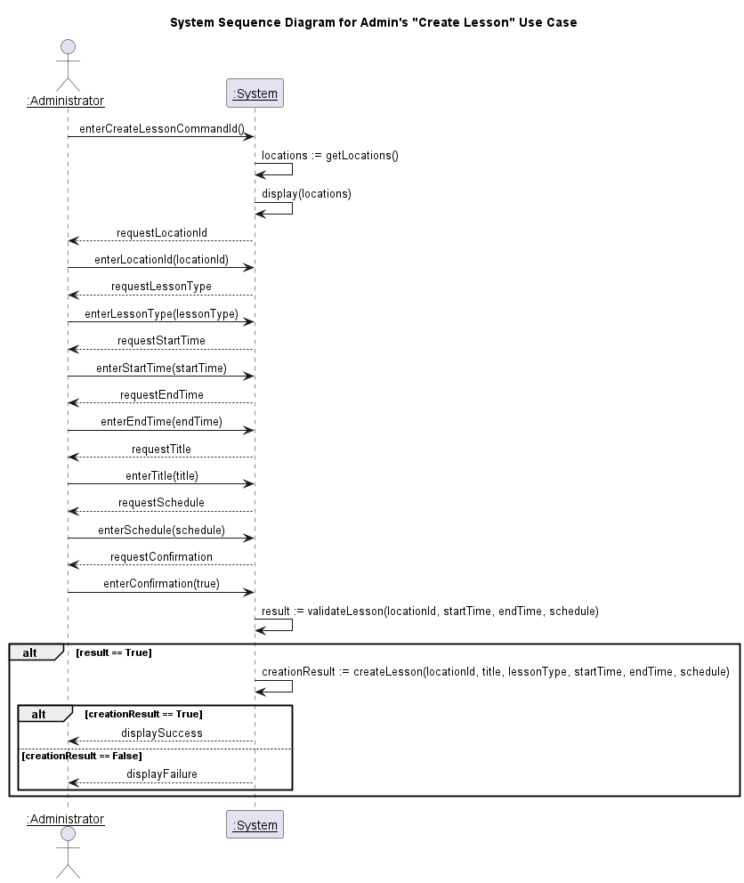
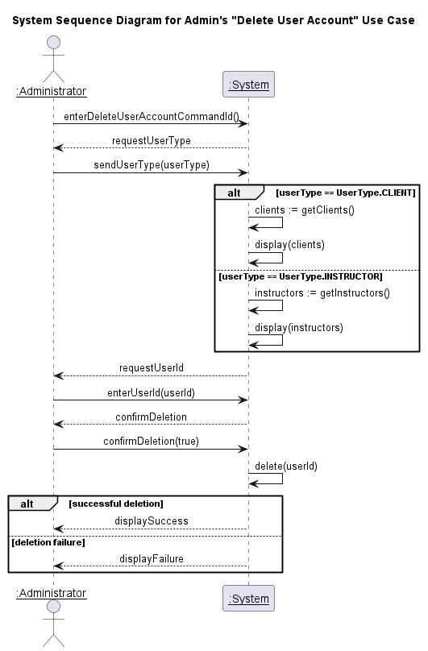
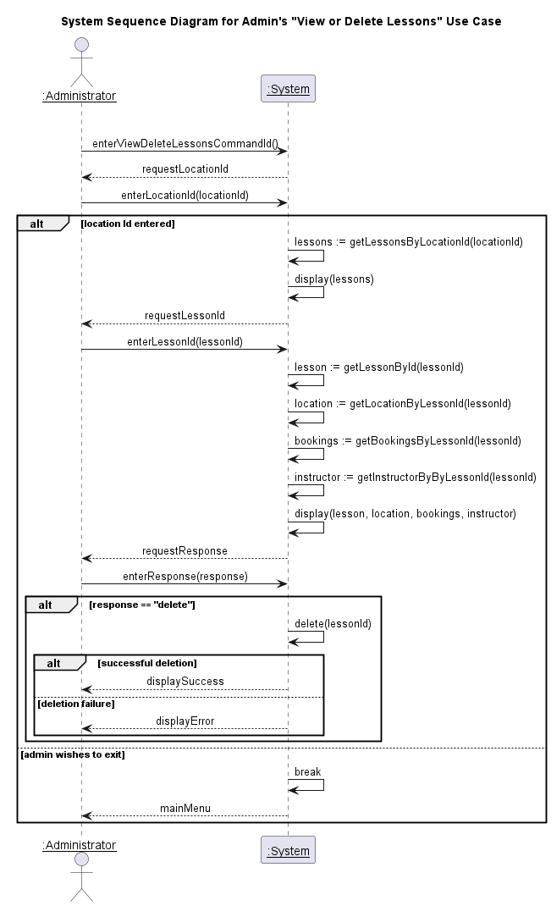
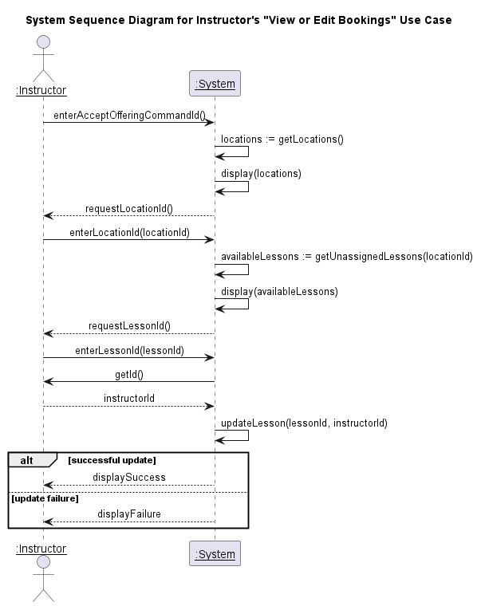
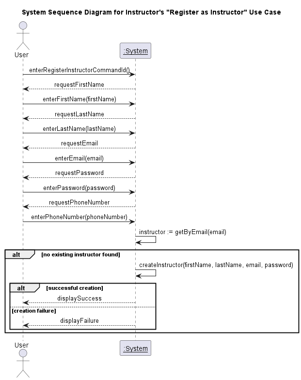
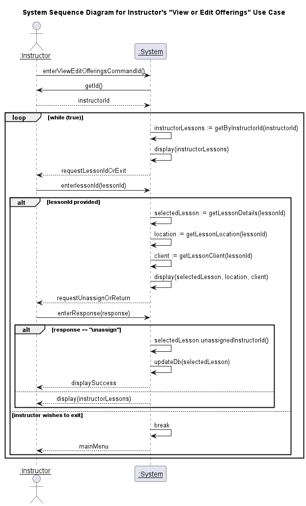
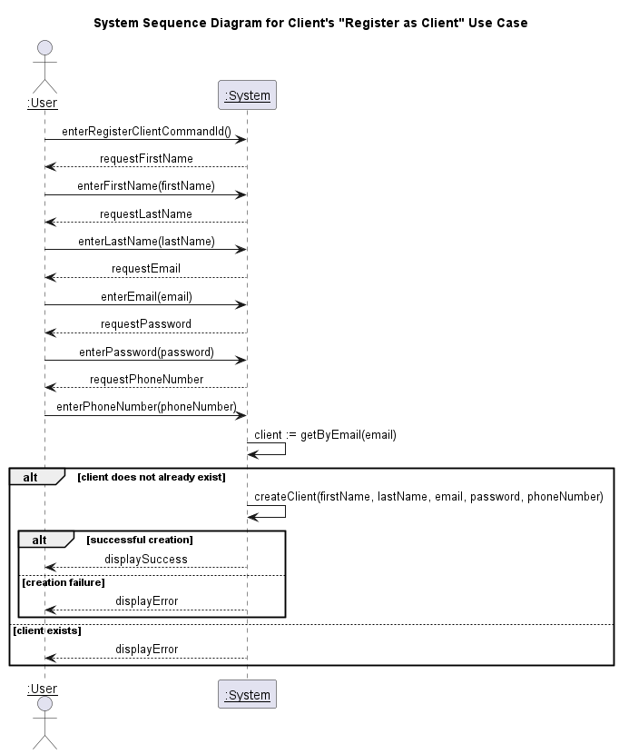
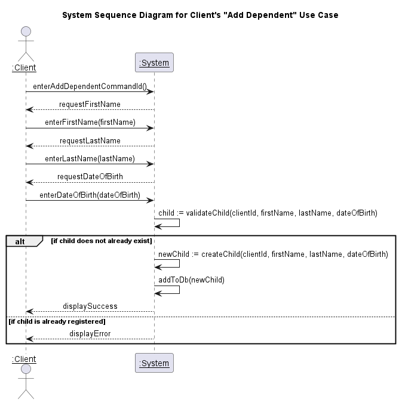
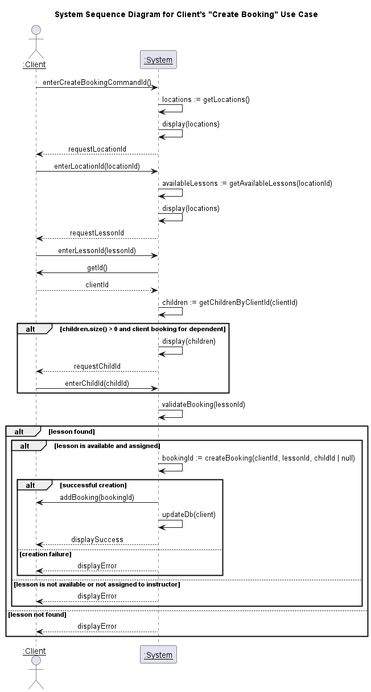
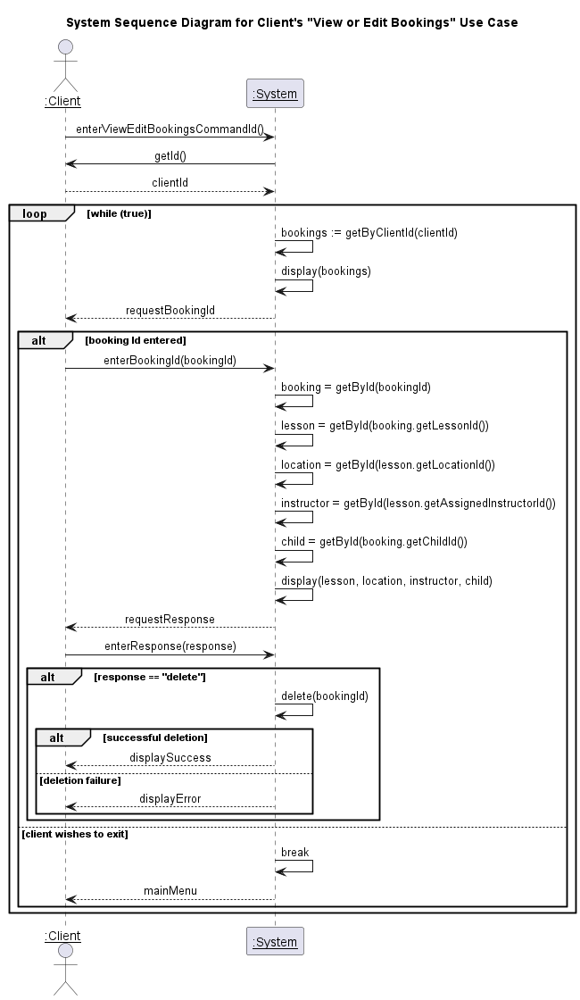

| Revision Number | Date       | Description of Changes            | Author / Editor            | Communication of Change |
| --------------- | ---------- | --------------------------------- | -------------------------- | ----------------------- |
| 1.0             | 2024-10-16 | Initial version                   | Nirav Patel, Laurenz Gomez | Internal Announcement   |
| 1.1             | 2024-10-22 | Refactor system sequence diagrams | Nirav Patel                | Internal Announcement   |
| 1.2             | 2024-11-03 | Refactor system sequence diagrams | Nirav Patel, Laurenz Gomez | Internal Announcement   |
| 1.3             | 2024-11-13 | Refactor system sequence diagrams | Nirav Patel, Laurenz Gomez | Internal Announcement   |

# Table of Contents

- [Administrator](#administrator)
  - [Create Lesson System Sequence Diagram](#create-lesson-system-sequence-diagram)
  - [Delete User Account System Sequence Diagram](#delete-user-account-system-sequence-diagram)
  - [View or Delete Lessons System Sequence Diagram](#view-or-delete-lessons-system-sequence-diagram)
- [Instructor](#instructor)
  - [Accept Offering System Sequence Diagram](#accept-offering-system-sequence-diagram)
  - [Register as Instructor System Sequence Diagram](#register-as-instructor-system-sequence-diagram)
  - [View or Edit Offerings System Sequence Diagram](#view-or-edit-offerings-system-sequence-diagram)
- [Client](#client)
  - [Register as Client System Sequence Diagram](#register-as-client-system-sequence-diagram)
  - [Add Dependent System Sequence Diagram](#add-dependent-system-sequence-diagram)
  - [Create Booking System Sequence Diagram](#create-booking-system-sequence-diagram)
  - [View or Edit Bookings System Sequence Diagram](#view-or-edit-bookings-system-sequence-diagram)

# Administrator

## Create Lesson System Sequence Diagram

## Delete User Account System Sequence Diagram

## View or Delete Lessons System Sequence Diagram

# Instructor

## Accept Offering System Sequence Diagram

## Register as Instructor System Sequence Diagram

## View or Edit Offerings System Sequence Diagram

# Client

## Register as Client System Sequence Diagram

## Add Dependent System Sequence Diagram

## Create Booking System Sequence Diagram

## View or Edit Bookings System Sequence Diagram

