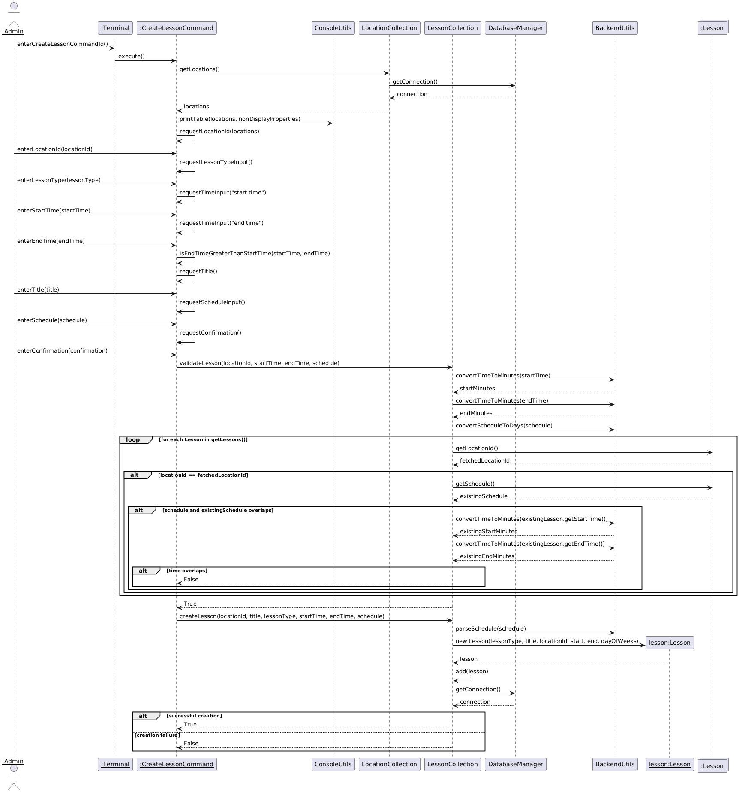
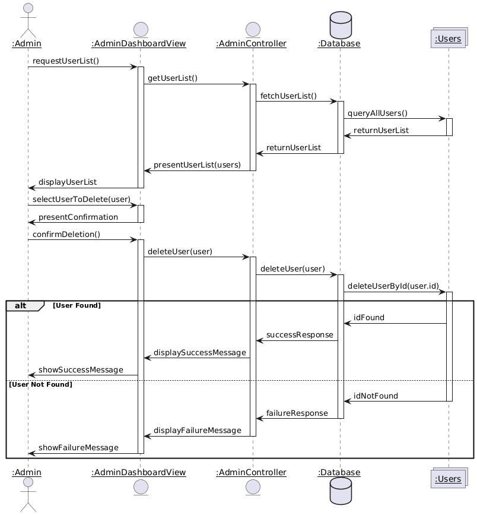
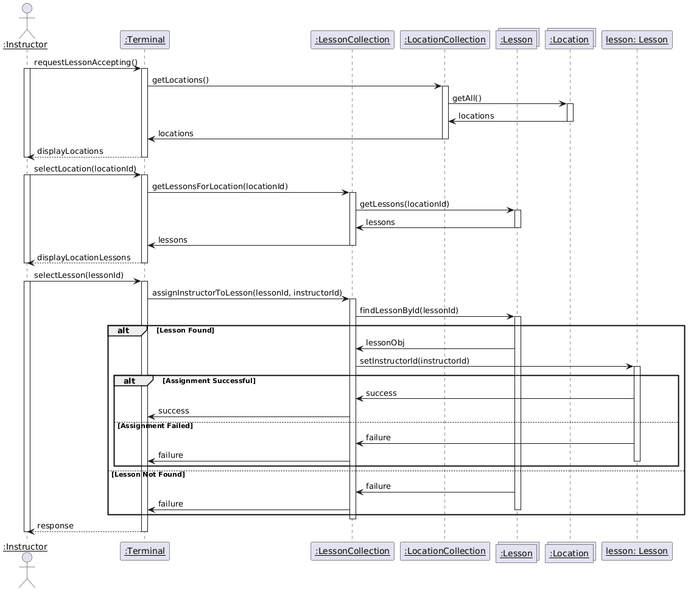
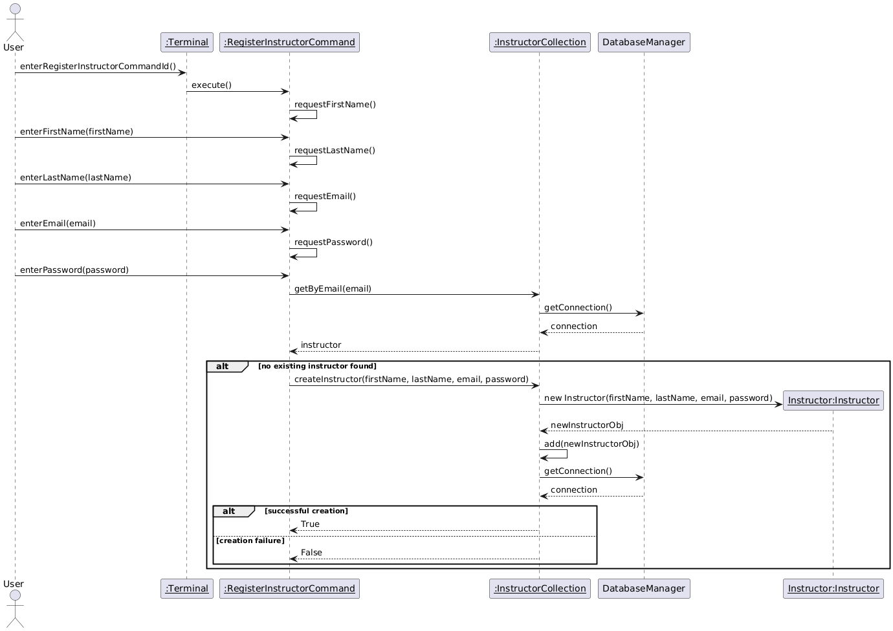
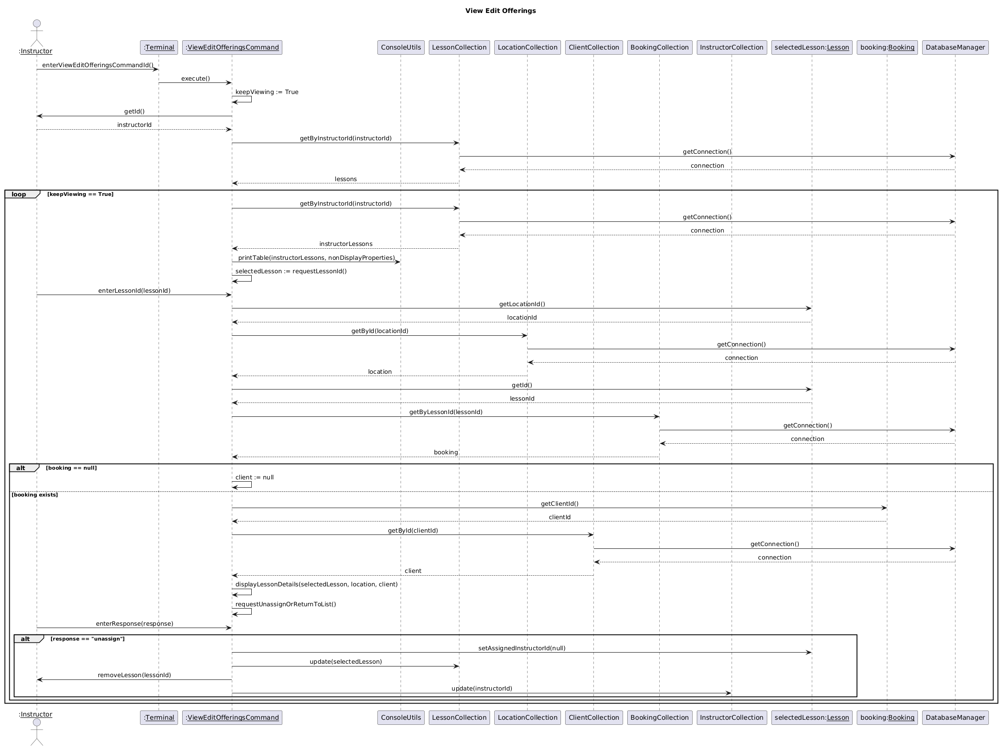
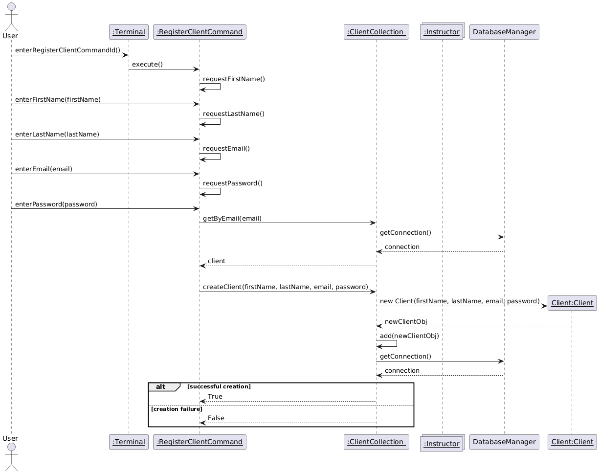
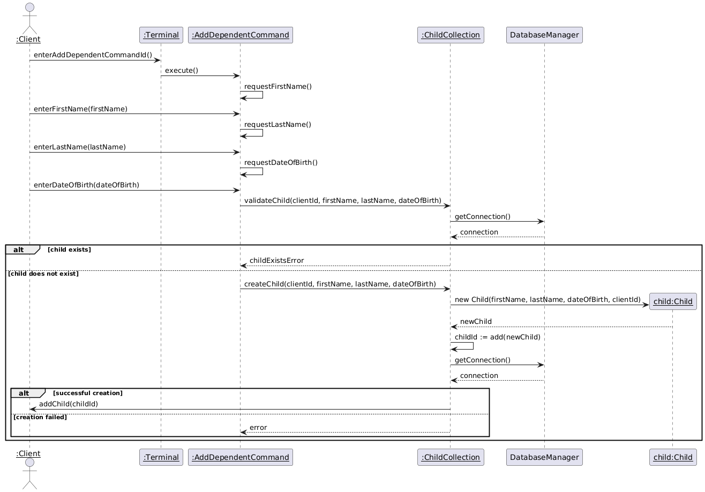
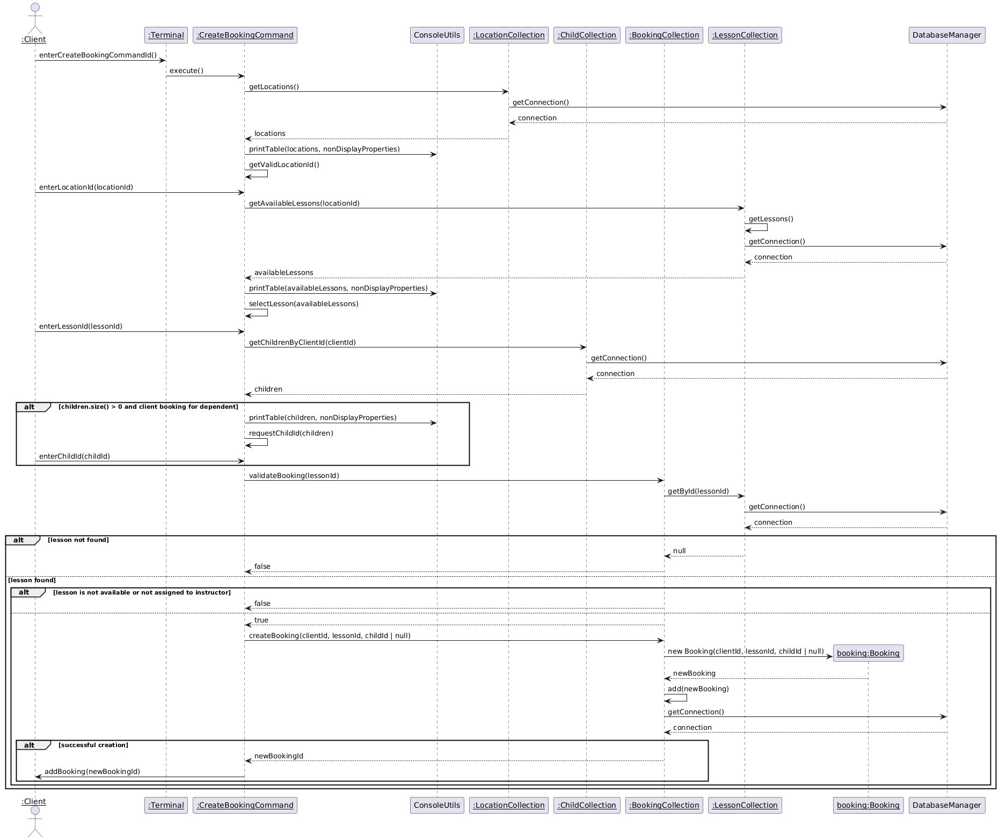
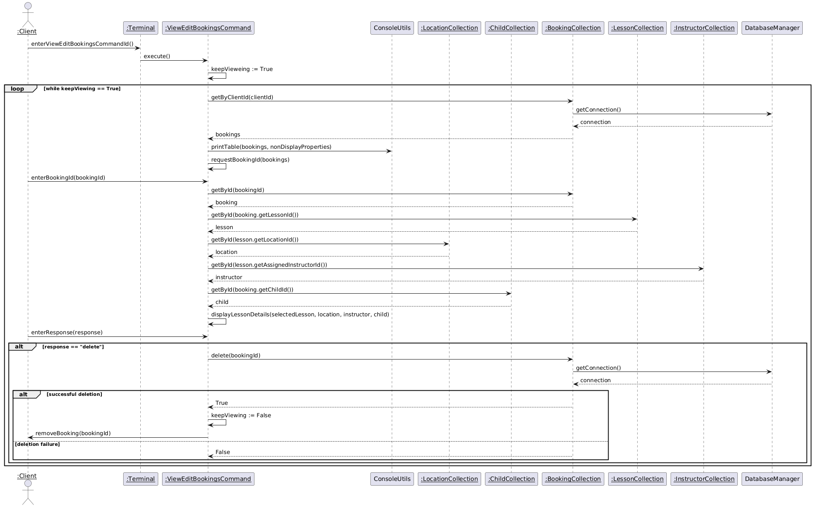

| Revision Number | Date       | Description of Changes        | Author / Editor            | Communication of Change |
| --------------- | ---------- | ----------------------------- | -------------------------- | ----------------------- |
| 1.0             | 2024-10-16 | Initial version               | Nirav Patel, Laurenz Gomez | Internal Announcement   |
| 1.1             | 2024-10-22 | Refactor interaction diagrams | Nirav Patel                | Internal Announcement   |
| 1.2             | 2024-11-03 | Refactor interaction diagrams | Nirav Patel, Laurenz Gomez | Internal Announcement   |

# Table of Contents

- [Administrator](#administrator)
  - [Create Lesson Interaction Diagram](#create-lesson-interaction-diagram)
  - [Delete User Account Interaction Diagram](#delete-user-account-interaction-diagram)
- [Instructor](#instructor)
  - [Accept Offering Interaction Diagram](#accept-offering-interaction-diagram)
  - [Register as Instructor Interaction Diagram](#register-as-instructor-interaction-diagram)
  - [View or Edit Offerings Interaction Diagram](#view-or-edit-offerings-interaction-diagram)
- [Client](#client)
  - [Register as Client Interaction Diagram](#register-as-client-interaction-diagram)
  - [Add Dependent Interaction Diagram](#add-dependent-interaction-diagram)
  - [Create Booking Interaction Diagram](#create-booking-interaction-diagram)
  - [View or Edit Bookings Interaction Diagram](#view-or-edit-bookings-interaction-diagram)

# Administrator

## Create Lesson Interaction Diagram

## Delete User Account Interaction Diagram

# Instructor

## Accept Offering Interaction Diagram

## Register as Instructor Interaction Diagram

## View or Edit Offerings Interaction Diagram

# Client

## Register as Client Interaction Diagram

## Add Dependent Interaction Diagram

## Create Booking Interaction Diagram

## View or Edit Bookings Interaction Diagram

